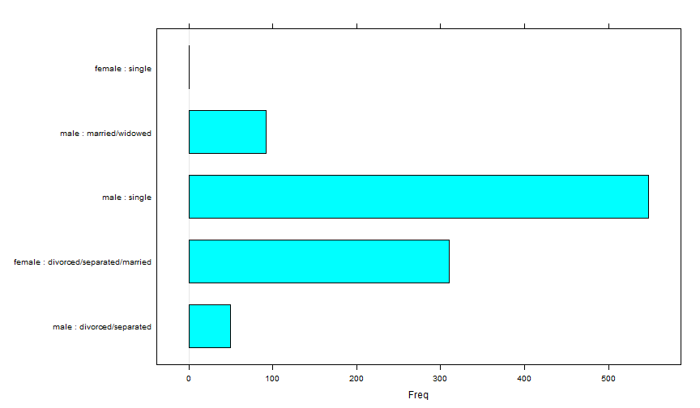
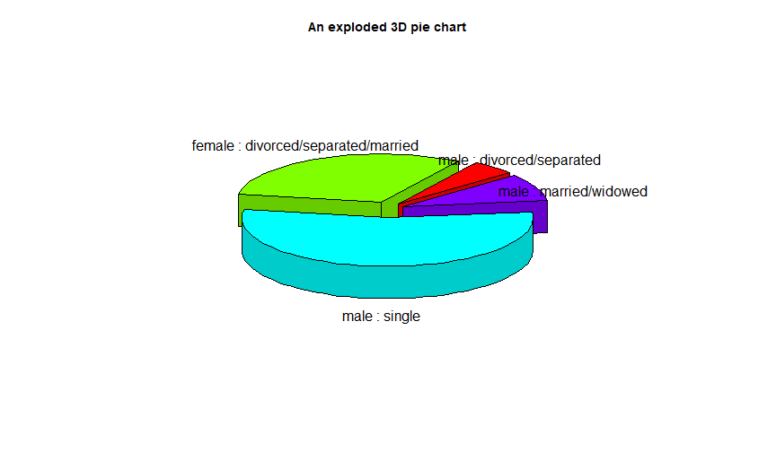
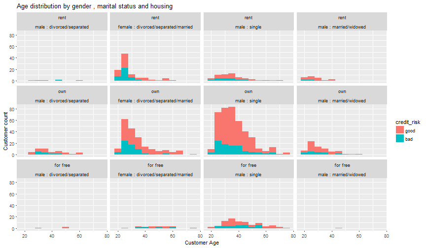
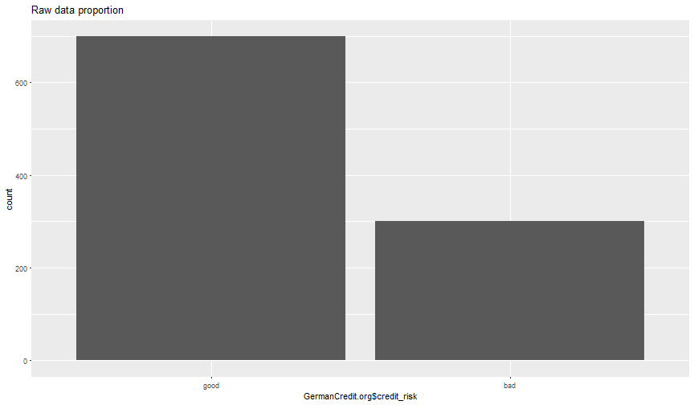
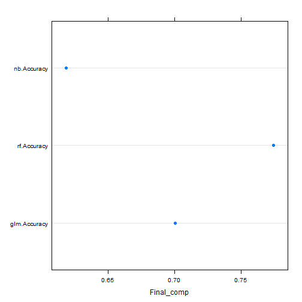

<section class="slide1">
  <h2>German Credit Data - Project description</h2>
  <p>When a bank receives a loan application, based on the applicant's profile the bank has to make a decision regarding whether to go ahead with the loan approval or not</p>
  <ol>
    <li>
      <h3>Risk factors</h3>
      <p>If the applicant is a good credit risk, i.e. is likely to repay the loan, then not approving the loan to the person results in a loss of business to the bank</p>
	  <p>If the applicant is a bad credit risk, i.e. is not likely to repay the loan, then approving the loan to the person results in a financial loss to the bank</p>
    </li>
    <li>
      <h3>Overall objective</h3>
      <p>Minimization of risk and maximization of profit on behalf of the bank</p>
    </li>	
  </ol>
</section>

---
<h2>Environment set-up</h2>

```r
options(warn = -1)
library(klaR)
```

```
## Loading required package: MASS
```

```r
library(MASS)
data("GermanCredit")
library(caret)
```

```
## Loading required package: lattice
```

```
## Loading required package: ggplot2
```

```r
require(ggplot2)
GermanCredit.org<-GermanCredit
```

--- 

```r
#levels(GermanCredit.org$personal_status_sex)
barchart(table(GermanCredit.org$personal_status_sex))
```



--- 
<h2>Removing the additional level from Gender</h2>

```r
GermanCredit.org$personal_status_sex<-droplevels(GermanCredit.org$personal_status_sex)
levels(GermanCredit.org$personal_status_sex)<-levels(GermanCredit.org$personal_status_sex)[1:4]
levels(GermanCredit.org$personal_status_sex)
```

[1] "male : divorced/separated"          
[2] "female : divorced/separated/married"
[3] "male : single"                      
[4] "male : married/widowed"             

---

```r
library(plotrix)
pie3D(table(GermanCredit.org$personal_status_sex),
    labels = levels(GermanCredit.org$personal_status_sex), 
main = "An exploded 3D pie chart", explode=0.1, radius=.9, labelcex = 1.3,  start=0.7)
```




---

```r
ggplot(GermanCredit.org, aes(age)) + geom_histogram(binwidth=4, colour="black", fill="green") +
  labs(x= "Age",y= "Frequency" , title = "Plot of Age")
```


---

```r
ggplot(GermanCredit.org,aes(x=age,fill=credit_risk))+facet_wrap(~personal_status_sex)+
  geom_histogram(binwidth = 5)+labs(x="Customer Age",y="Customer count",
     title="Age distribution by gender and marital status")
```


---

```r
ggplot(GermanCredit.org,aes(x=age,fill=credit_risk))+
  facet_wrap(~housing)+
  geom_histogram(binwidth = 5)+labs(x="Customer Age",y="Customer count",
          title="Age distribution by housing")
```


---

```r
ggplot(GermanCredit.org,aes(x=age,fill=credit_risk))+
  facet_wrap(housing~personal_status_sex)+
    geom_histogram(binwidth = 5)+labs(x="Customer Age",y="Customer count",
title="Age distribution by gender , marital status and housing")
```



---
<h2>Actual data is biased towards Good</h2>

```r
qplot(GermanCredit.org$credit_risk,main="Raw data proportion")
```



---
<h2>...hence balancing the output variable</h2>

```r
#install.packages("unbalanced")
library(unbalanced)
library(mice)
#prop.table(table(GermanCredit.org$credit_risk))
n<-ncol(GermanCredit.org)
output <-GermanCredit.org[,n]
input <- GermanCredit.org[,-n]
data1<-ubBalance(X=input,Y=output,type="ubSMOTE",positive="bad",percOver=35, 
                 percUnder=450)
overdata1<-data.frame(data1$X, credit_risk=data1$Y)
#Removing null values that were introduced after balancing
#md.pattern(overdata1)
overdata1<-overdata1[complete.cases(overdata1),]
#prop.table(table(overdata1$credit_risk))
```

---


---
<h2>Random partition for train and test data set after balancing</h2>


```r
indx1<-(sample(1:nrow(overdata1),floor(nrow(overdata1)/3)))
train_data<-overdata1[-indx1,]
test_data<-overdata1[indx1,]
nrow(train_data)#67%
```

```
## [1] 515
```

```r
nrow(test_data)#33%
```

```
## [1] 257
```

```r
nrow(overdata1[rownames(test_data)%in%rownames(train_data),]) #Validation
```

```
## [1] 0
```

---
<h2>Building decision tree to identify the important features of the the data set that are actually contributing to our output variable</h2>

```r
par(mfrow=c(1,1))
rp1<-rpart::rpart(credit_risk~.,data=train_data)
rpart::printcp(rp1) # Returns important variables
```

```
## 
## Classification tree:
## rpart::rpart(formula = credit_risk ~ ., data = train_data)
## 
## Variables actually used in tree construction:
## [1] amount         credit_history duration       purpose       
## [5] status        
## 
## Root node error: 200/515 = 0.38835
## 
## n= 515 
## 
##       CP nsplit rel error xerror     xstd
## 1 0.1325      0     1.000  1.000 0.055301
## 2 0.0650      2     0.735  0.815 0.052775
## 3 0.0275      3     0.670  0.780 0.052141
## 4 0.0100      5     0.615  0.730 0.051139
```

---


---
<h1>Apply the identified important featrures to each models</h1>
<h2>Model 1 : GLM</h2>

```r
model_glm_f<-caret::train(credit_risk~age+amount+credit_history+duration+
                            installment_rate+housing+
                            property+purpose+status,
                          data=train_data,method="glm",family="binomial")
predict_glm_f<-predict(model_glm_f,newdata = test_data)
conf_glm<-confusionMatrix(data=predict_glm_f,test_data$credit_risk)
p1<-conf_glm$overall['Accuracy']
p1
```

```
##  Accuracy 
## 0.7003891
```

---
<h2>Model 2 : Random Forest</h2>


```r
model_nb_f<-caret::train(credit_risk~age+amount+credit_history+duration+
                           installment_rate+housing+
                           property+purpose+status,data=train_data,method="rf")
predict_nb_f<-predict(model_nb_f,newdata = test_data)
conf_rf<-confusionMatrix(data = predict_nb_f,test_data$credit_risk)
p2<-conf_rf$overall['Accuracy']
p2
```

```
##  Accuracy 
## 0.7743191
```

---
<h2>Model 3 : Naive Bayes</h2>

```r
model_nb_f<-caret::train(credit_risk~age+amount+credit_history+duration+
                             installment_rate+housing+
                             property+purpose+status,data=train_data,method="nb")
predict_nb_f<-predict(model_nb_f,newdata = test_data)
conf_nb<-confusionMatrix(data = predict_nb_f,test_data$credit_risk)
p3<-conf_nb$overall["Accuracy"]
p3
```

```
## Accuracy 
## 0.618677
```

---
<h2>Accuracy comparison to identify the winner!!!</h2>

```r
Final_comp<-c(glm=p1,rf=p2,nb=p3)
dotplot(Final_comp,horizontal=T)
```


